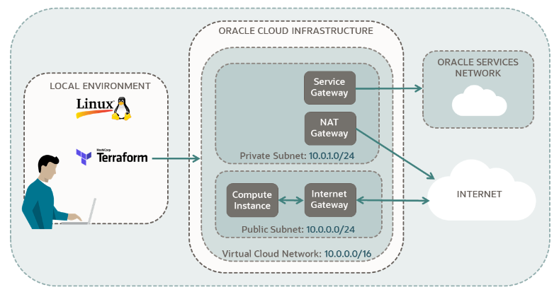

# Terraform OCI Infrastructure

This project sets up an Oracle Cloud Infrastructure (OCI) environment using Terraform. It includes the creation of a Virtual Cloud Network (VCN), subnets, security lists, and a compute instance.



## Project Structure

- `availabilty-domains.tf`: Defines the availability domains in the tenancy.
- `compartment.tf`: Creates a compartment in OCI.
- `compute.tf`: Provisions a compute instance in OCI.
- `outputs.tf`: Defines the outputs for the Terraform configuration.
- `private-security-list.tf`: Defines the security list for the private subnet.
- `private-subnet.tf`: Creates a private subnet in the VCN.
- `provider.tf`: Configures the OCI provider.
- `public-security-list.tf`: Defines the security list for the public subnet.
- `public-subnet.tf`: Creates a public subnet in the VCN.
- `variables.tf`: Defines the variables used in the Terraform configuration.
- `vcn-module.tf`: Configures the VCN module.

## Prerequisites

- Terraform installed on your machine.
- OCI CLI configured with the necessary credentials.

## Usage


1. Initialize Terraform:
    ```sh
    terraform init
    ```

2. Review the Terraform plan:
    ```sh
    terraform plan
    ```

3. Apply the Terraform configuration:
    ```sh
    terraform apply
    ```

## Outputs

The following outputs will be provided after the successful execution of the Terraform configuration:

- Availability Domains
- Compartment details
- Compute instance details (public IP, name, OCID, region, shape, state, OCPUs, memory, time created)
- VCN details (OCID, route table IDs, NAT gateway ID)
- Security list details (names and OCIDs for private and public security lists)
- Subnet details (names and OCIDs for private and public subnets)

